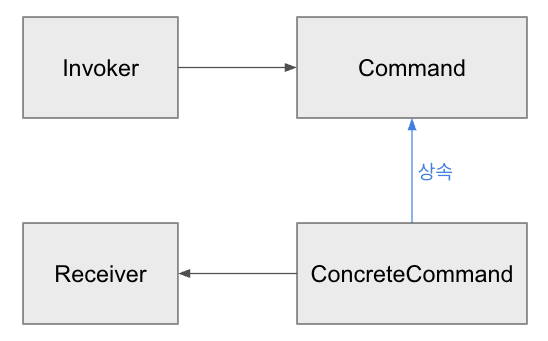
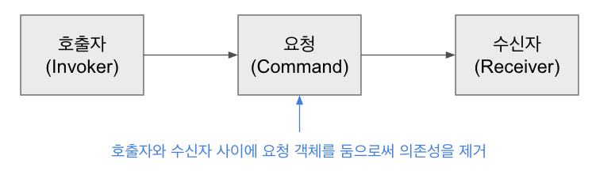

# Command 패턴이란?

- 요청(실행될 기능) 자체를 객체화하는 것
    - 이를 통해 주어진 여러 기능을 실행할 수 있는 재사용성이 높은 클래스를 설계하는 패턴
- **각각의 개별 요청**에 대해 클래스를 작성
- 요청을 객체화함으로써 호출자와 수신자 클래스 사이의 의존성을 제거

---
# Command 패턴의 클래스

### 1. Command

- 실행될 기능에 대한 인터페이스
- 기능은 execute 메서드로 선언 - 자식 클래스에서 구현

### 2. ConcreteCommand

- 실제로 실행되는 기능을 각각 구현

### 3. Invoker

- 기능의 실행을 요청하는 호출자

### 4. Receiver

- 명령을 실행

---

# Command 패턴 예제
### 가정
- 장사가 잘 되는 양식당이 있다.
- 이 식당은 Pizza / Pasta를 만드는 요리사가 각각 개별로 존재한다.
- 이에 따라 홀에서 Pizza / pasta 주문을 받는 스태프도 각각 개별로 존재한다고 가정한다.
### Command 패턴 적용
- 손님은 스태프에게 주문을 넣으며, 스태프는 해당 주문을 요리사에게 전달
- 이 때, 손님 = 호출자(Invoker), 스태프 = 요청(Command), 요리사 = (Receiver)
  - 손님은 "요리를 만들어 달라"는 기능의 실행을 요청
  - 스태프는 해당 요청을 전달하는 객체
  - 요리사는 "요리를 만든다"는 기능의 실행을 수행
- 번외) 만약 요리를 다 만들고 손님에게 전해준다면?
  - 손님과 요리사의 역할이 바뀌게 될 것
### 상속 이용
- 스태프를 각각 개별이 아닌, 한명으로 만든다면?
- 각각의 요리사를 하나의 인터페이스로 상속받게 만들어서 해결할 수 있지 않을까?
- 일단 만들어 보기는 했는데, 법칙에 위반되는지는 잘 모르겠음...
- 스터디장님 질문해주세용
---

# Command 패턴의 장단점

---

# Command 패턴의 실무 적용